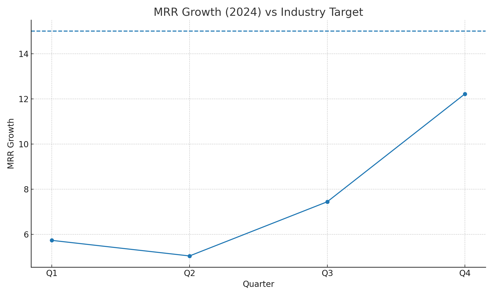
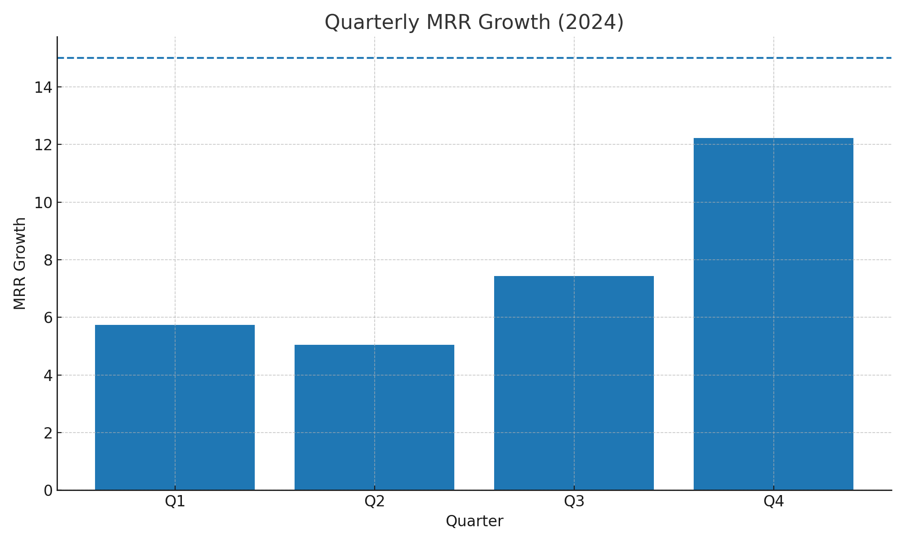

# SaaS Technology Performance Analysis — 2024 MRR Growth

**Prepared by:** 22f3001135@ds.study.iitm.ac.in  
**Date:** 2025-08-20  
**LLM assistance:** Jules (ChatGPT Codex) / ChatGPT

## Business Context
The executive team has observed a **slowdown in Monthly Recurring Revenue (MRR) growth**. The industry benchmark is **15**, while our current **average** for 2024 is **7.61**.

## Dataset
**Monthly Recurring Revenue (MRR) Growth — 2024 (Quarterly)**
- Q1: 5.73
- Q2: 5.04
- Q3: 7.44
- Q4: 12.22
- **Average:** 7.61

**Industry Target:** 15

> Data source: `data/quarterly_mrr_2024.csv`

## Key Findings
1. **Average MRR growth is 7.61**, which is **7.39 points below** the industry target of 15.  
2. Growth shows a **positive trajectory in Q4 (12.22)**, indicating momentum from recent initiatives or seasonality.  
3. **Q1–Q3 underperformance** pulled down the annual average; the **gap is structural**, not a one-quarter anomaly.

## Business Implications
- At the current pace, **ARR expansion goals will be missed**, impacting hiring, roadmap delivery, and GTM budgets.
- **CAC payback may lengthen**, stressing cash efficiency.
- **Opportunity cost**: competitors capturing high-growth segments while our core stalls.

## Recommendation (Primary)
**Expand into new market segments.**  
Prioritize ICPs with:
- Demonstrated willingness-to-pay and short sales cycles
- High attach potential for add-ons (analytics, SSO, premium support)
- Fit with product strengths (e.g., compliance-ready, API-first, low-integration)

### Supporting Actions
- Launch **segment-specific bundles** and pricing pages.
- Build **targeted partner integrations** (ecosystem pull).
- Stand up **segment GTM pods** (PMM + SDR + AE) with dedicated quotas.
- Add **usage-based accelerator** to lift expansion revenue in fast-adopting cohorts.

## Visualizations
Line vs benchmark:



Bars per quarter vs target:



## Reproducible Analysis (Python)
Run locally:

```bash
python -m venv .venv
# Windows
.venv\Scripts\activate
# macOS/Linux
# source .venv/bin/activate

pip install -r requirements.txt
python analysis.py
```

## How this was built
- Code and visuals generated with assistance from **Jules (ChatGPT Codex) / ChatGPT**.
- Version-controlled for review in a **GitHub Pull Request**.

## Pull Request Checklist
- [x] Includes **analysis code** (`analysis.py`)
- [x] Includes **visualizations** (in `images/`)
- [x] README contains **email** and **correct average 7.61**
- [x] Recommendation explicitly states: **"expand into new market segments"**
- [x] Mentions LLM assistance
